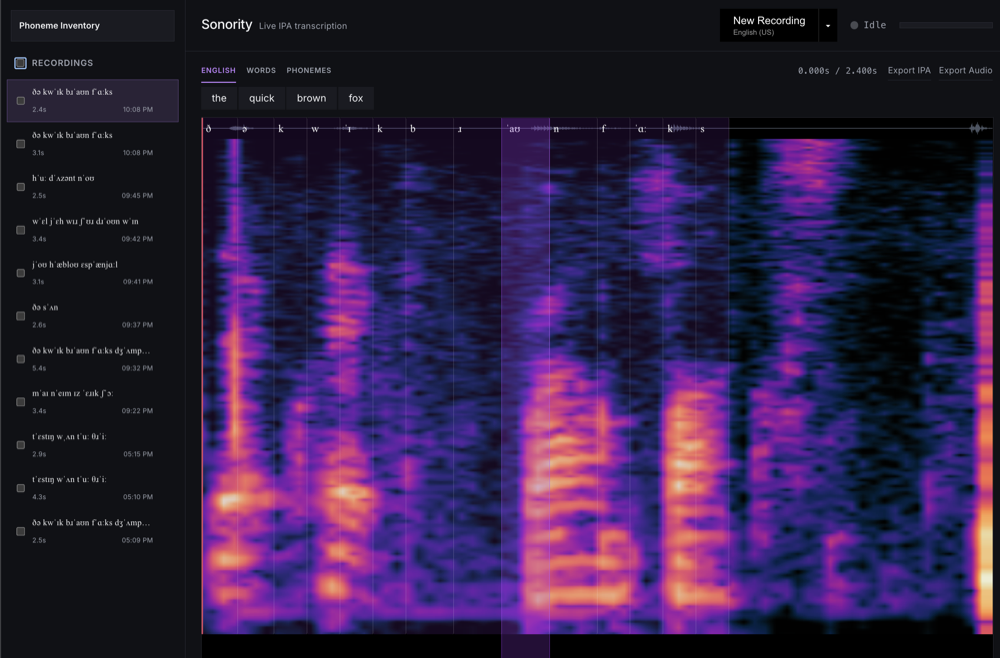
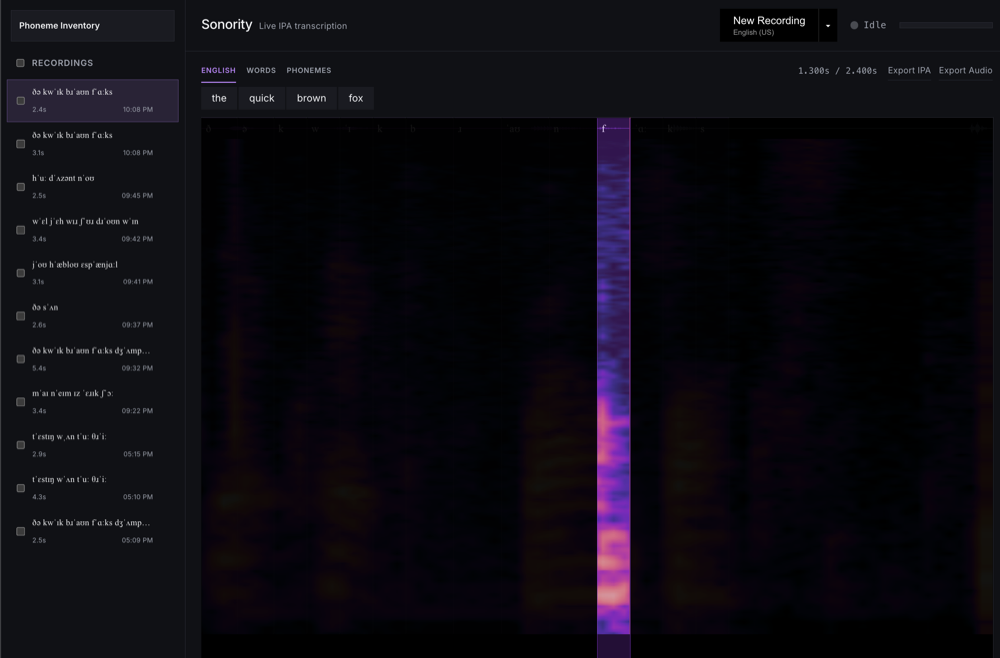
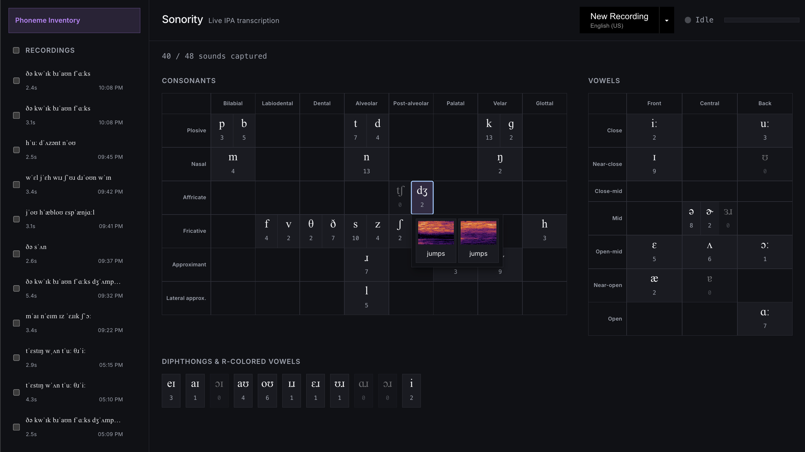

# Phonemizer Live


Live IPA (International Phonetic Alphabet) transcription service. You can record speech in the browser, and get back a word-level transcript, a per-phoneme IPA breakdown aligned to a spectrogram, and a running inventory of each phoneme as identified by `phonemizer`.

I created this to investigate my Sonority font. Because my font is an exploration of what more integrated perceptual cues might look like, I wanted to understand how segments for each phoneme differ on spectrographic analysis. More broadly, this tool can be used to play with quick recordings, and help users understand better what individual speech sounds entail.

## Screenshots


*Recording view — spectrogram segmented into phoneme regions, synced to the transcript above.*


*Hover spotlight — mousing over the waveform isolates one phoneme and blacks out the rest for close inspection.*


*Phoneme inventory — every captured sound plotted on standard IPA consonant/vowel charts, with click-to-preview spectrogram thumbnails.*

## Summary

- **Recording** — browser mic capture, auto-segmented on silence
  (`useAudioSegmenter.js`), one utterance per segment.

- **Transcription** — `faster-whisper` (`small.en`, or `small` for
  non-English languages) produces word-level timestamps.

- **Phonemization** — `phonemizer` (espeak-ng backend) converts each word to
  IPA. Default language is English (US); a caret dropdown on the record
  button switches to Chinese (Mandarin), Spanish, Hindi, French, Arabic,
  Portuguese, Russian, German, or Japanese.

- **Alignment** — phonemes within a word are evenly distributed across that
  word's whisper timestamp span. Currently this is still an approximation produced by the phonemizer library.
  alignment.

- **Spectrogram** — rendered server-side (`scipy.signal.spectrogram` + PIL,
  custom colormap) for both full recordings and per-phoneme thumbnails.

- **Playback UI** — `wavesurfer.js` with a Regions plugin: click a phoneme to
  play just that segment, hover to spotlight it, three transcript views
  (English / Words / Phonemes).

- **Phoneme inventory** — a separate tab charting every captured phoneme
  against a standard IPA consonant/vowel table, with click-to-preview
  spectrogram thumbnails per example.

- **Export** — per-recording IPA text and WAV audio, plus bulk zip export;
  bulk delete from the sidebar.

- **Storage** — Currently local only: SQLite (`backend/data/`) for transcripts,
  WAV + PNG files alongside it. Nothing leaves the machine.

## Architecture

```
frontend/   React + Vite (port 5174)
backend/    FastAPI + SQLite (port 8000)
```

The frontend talks to the backend via `API_BASE` in `frontend/src/App.jsx`,
which reads `import.meta.env.VITE_API_BASE` and falls back to
`http://127.0.0.1:8000` for local dev. Production builds pick up
`frontend/.env.production` (`https://api.phonemizer.live`) automatically.

## Prerequisites (macOS)

- Python 3.11+
- Node 18+
- `ffmpeg` — audio format conversion
- `espeak-ng` — phonemizer's G2P backend

```bash
brew install ffmpeg espeak-ng
```

## Local deployment

### 1. Backend

```bash
cd backend
python3 -m venv venv
source venv/bin/activate
pip install -r requirements.txt
uvicorn main:app --host 127.0.0.1 --port 8000 --reload
```

First run downloads the whisper model (`small.en`, plus `small` on first use
of a non-English language) — expect a delay and a few hundred MB on disk.

SQLite DB and per-recording WAV/PNG files are created under
`backend/data/` automatically; nothing to provision.

### 2. Frontend

```bash
cd frontend
npm install
npm run dev
```

Vite defaults to port 5173 but will pick the next free port (5174 on this
machine) if it's taken — check the terminal output for the actual URL.

### 3. Use it

Open the frontend URL, click **New Recording**, grant microphone access, and
speak. The backend's CORS config (`backend/main.py`) currently only allows
`http://localhost:5173` and `http://localhost:5174` — add any other origin
you serve the frontend from before it will work cross-origin.

## Production deployment

Dockerized (`backend/Dockerfile`, `frontend/Dockerfile`), orchestrated via
`docker-compose.yml` with Caddy handling HTTPS for `phonemizer.live` +
`api.phonemizer.live`, and deployed automatically by
`.github/workflows/deploy.yml` on push to `main`. See **[DEPLOYMENT.md](DEPLOYMENT.md)**
for the one-time server setup and GitHub secrets this needs.

## Known limitations

- Phoneme timing is linear interpolation within each whisper word span, not
  forced alignment — timings within multi-syllable words are approximate.
- The phoneme inventory chart layout is English-specific; other languages'
  phonemes still get transcribed but fall into an "other" bucket rather than
  the chart.
- `sonority_2.ttf` in the repo root is a custom display font not yet wired
  into the UI.
